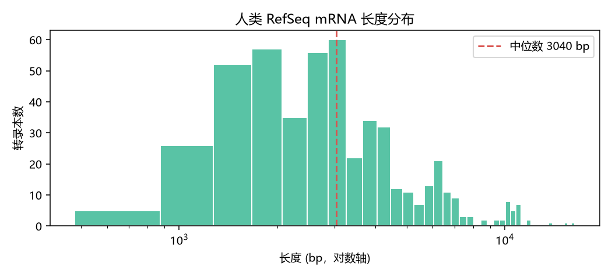
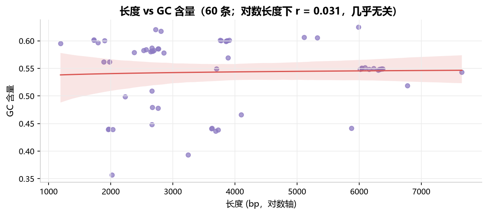
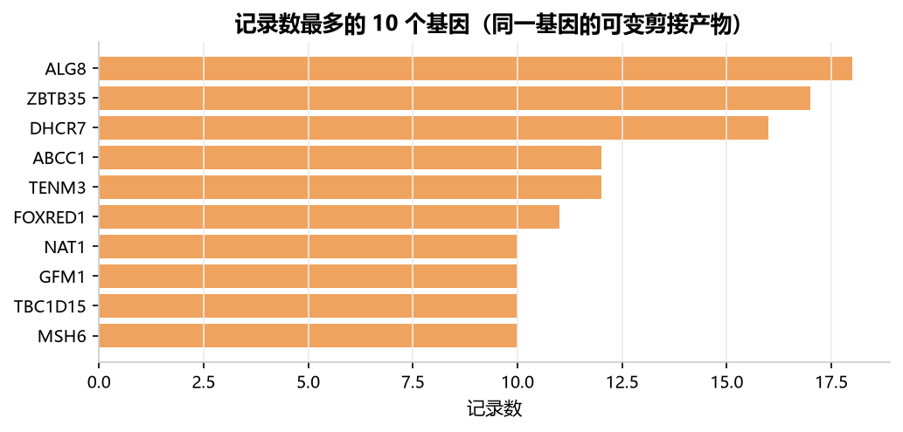

# 人类 RefSeq mRNA 的长度与 GC 特征分析

> 从 NCBI 公开库取回 500 条人类 RefSeq mRNA 记录，清洗成可用表，用 4 张图回答一个问题：**这批转录本在长度和碱基组成上有什么规律？**
> 全部代码可复现，三条命令跑通（见下）。

[](https://www.python.org/)
[](LICENSE)






## 关键数字（2026-09-23 实测）

| 指标 | 结果 |
|---|---|
| 记录 / 覆盖基因 | 500 条 / **142 个基因** |
| 序列长度 | 中位 **3040 bp**（478 – 16398 bp），强右偏 |
| GC 含量（500 条全部有值） | 中位 **47.2%**（32.8% – 73.3%） |
| 对数长度 vs GC 相关系数 | **−0.197** —— 弱负相关：转录本越长，GC 略低 |
| 2022–2023 两年占全表 | **46%** —— 是 NCBI 批量重注释，不是生物学变化 |

## 这份分析解决什么问题

生信日常拿到的第一份数据，几乎总是"别人导出的表"：列名混乱、日期是字符串、同一样本多个副本、关键列大量缺失。
这个项目把**从公开库取数 → 清洗 → 出图 → 得出结论**这条链路完整走一遍，并留下可复现的代码：

- `w1/` 写序列处理的基础工具（FASTA 解析、密码子翻译、真实序列拉取）
- `w2/` 用 pandas 处理真实记录表，产出上面 4 张图
- `viz.py` 统一出图规范：字体、配色、边框、dpi 一处控制，改一处所有图一起变

## 怎么复现

```bash
# 1. 建环境（uv 或 venv 都行）
uv venv && uv pip install --python .venv/Scripts/python.exe \
    --index-url https://pypi.tuna.tsinghua.edu.cn/simple -r requirements.txt

# 2. 取数据：500 条人类 RefSeq mRNA 记录
python w2/fetch_dataset.py 500

# 3. 给部分记录补真实 GC 含量（练习缺失值处理）
python w2/add_gc.py 500

# 4. 清洗 + 出图：在 VS Code 里打开 notebook 逐格运行
#    w2/分析.ipynb
```

`w1/` 里的四个脚本也可以单独跑：

```bash
python w1/gc_content.py w1/sample.fasta     # 读 FASTA，算长度与 GC
python w1/rev_comp.py                       # 反向互补 + 密码子翻译
python w1/fasta_to_csv.py w1/sample.fasta   # 统计结果写成 CSV
python w1/fetch_ncbi.py NM_000546           # 拉人类 TP53 mRNA 再统计
```

## 项目结构

```
bio-ai-prep/
├── viz.py                 统一出图规范（字体/配色/边框/dpi）
├── requirements.txt
├── .env.example          API key 模板（真的 key 放 .env，不入库）
├── w1/                    Python 地基：序列解析与统计
│   ├── gc_content.py          读 FASTA → 长度 / GC
│   ├── rev_comp.py            反向互补 + 密码子翻译
│   ├── fasta_to_csv.py        统计结果 → CSV（含边界处理）
│   └── fetch_ncbi.py          从 NCBI 拉真实序列（E-utilities，无需 key）
├── w2/                    真实数据表：清洗与可视化
    ├── fetch_dataset.py       esearch + esummary → 500 条记录表
    ├── add_gc.py              复用 w1 的函数，补全部 500 条 GC（分批 + 重试）
    ├── data/                  原始表 + GC 表（CSV，已入库）
    ├── out/                   4 张图（PNG，已入库）
    └── 分析.ipynb             清洗 + 出图 + 结论（含真实输出）
└── w4/                    大模型 API：流式对话与成本统计
    ├── llm.py                 封装：SSE 流式 / 超时 / 指数退避重试 / 计价
    ├── chat.py                命令行多轮对话（/cost /reset /exit）
    └── logs/usage.csv         每次调用的 token 与花费流水
└── w5/                    RAG 文档问答：检索 + 带引用回答
    ├── fetch_pubmed.py        拉 PubMed 摘要作语料（真实生物医药文本）
    ├── text.py                切分（句子边界 + 重叠）与中英混合分词
    ├── store.py               BM25 索引：建索引 / 检索 / 存取
    ├── build_index.py         切块建索引 → w5/index/bm25.json
    ├── ask.py                 提问 → 检索 → 带引用回答（call W4 的 llm.py）
    └── data/pubmed.jsonl      语料：100 篇摘要（已入库）
```

## w4 脚本（接大模型 API：流式 / 重试 / 成本）

```bash
cp .env.example .env        # 填入自己的 DEEPSEEK_API_KEY（.env 不入库）
python w4/chat.py           # 多轮对话：流式输出，每轮显示 token 与花费
```

实测（2026-09-23，`deepseek-flash`，高峰时段）：

| 场景 | 输入 tokens | 缓存命中 | 输出 tokens | 耗时 | 花费 |
|---|---|---|---|---|---|
| 单轮问答（RAG 是什么） | 70 | 0 | 277 | 2.08 s | 0.001178 元 |
| 多轮追问 | 133 | 0 | 190 | 1.40 s | 0.000893 元 |
| 1728 tokens 长前缀 · 首次 | 1728 | 0 | 60 | 0.69 s | 0.001968 元 |
| 同一前缀 · 第二次 | 1728 | **1536** | 97 | 1.11 s | **0.000611 元（↓69%）** |

四个工程要点（都写在 `w4/llm.py` 里）：

1. **只用标准库** `urllib` 手写 SSE 解析 —— 看清"流式"其实就是一行行 `data: {...}`。
2. **重试**：网络错误 / 429 / 5xx 按 1s → 2s → 4s 指数退避，最多 3 次；参数错（4xx）不重试，因为重试没意义。
3. **超时**：默认 60 秒可配，避免调用挂死。
4. **成本**：按[官方价目表](https://api-docs.deepseek.com/zh-cn/quick_start/pricing)自动判断高峰/空闲（空闲时段半价），并区分**缓存命中**与**未命中**分别计价 —— 上面第 3、4 行就是缓存把同一段长前缀变便宜 69% 的实测。

每次调用都会往 `w4/logs/usage.csv` 追加一行（时间、模型、token、是否高峰、花费、耗时），方便回看"这个月花了多少"。

## w5 脚本（RAG 文档问答：检索 + 带引用回答）

```bash
python w5/fetch_pubmed.py 100 "single-cell RNA sequencing AND cancer"  # 拉 100 篇 PubMed 摘要
python w5/build_index.py                                              # 切分 + 建索引
python w5/ask.py "单细胞测序怎么用来研究肿瘤内部的细胞异质性？"          # 提问 → 检索 → 带引用回答
python w5/ask.py --search-only "spatial transcriptomics tumor"         # 只看检索结果
```

实测（2026-09-23，语料 = 100 篇 PubMed 摘要 → 442 块 / 4,670 个词）：

| 环节 | 结果 |
|---|---|
| 英文检索 | top1 = PMID 40804688（BM25 10.94），top5 全部相关 |
| 中文提问 | 自动改写成英文关键词（`single-cell sequencing tumor intratumoral heterogeneity cancer scRNA-seq`）再检索 |
| 生成回答 | 逐句带 [1]–[5] 引用｜673 + 1115 tokens｜5.55 s｜**0.005133 元** |
| 边界测试（问语料里没有的） | 回答「资料里没有提到 CRISPR 碱基编辑在玉米育种中的应用效果」—— **没编** |

调参实测（同一个 query，只改块长）：块长 600 时 top5 来自 4 篇不同论文；改成 400 后分数更高（11.37 vs 10.94），但 top5 里有 3 块来自同一篇 —— **分数涨了，多样性掉了**。所以块长不是越小越好。

三个设计取舍：

1. **为什么先用 BM25 而不是向量**：DeepSeek 没有 embedding 接口，本地向量模型要下几百 MB。BM25 零依赖、可解释；要换成语义检索，只需重写 `w5/store.py` 里的 `search()`，上层代码不动。
2. **中文问、英文语料**：词面检索下中文词在索引里根本不存在，所以提问后先让模型把问题改写成英文关键词（`rewrite_query`）—— 这是跨语言 RAG 绕不开的一步。
3. **切分带重叠**：按句子边界切、相邻块重叠 100 字符，避免答案正好落在切口上。

## 数据来源与调用礼节

- 数据：[NCBI E-utilities](https://www.ncbi.nlm.nih.gov/books/NBK25501/)（`eutils.ncbi.nlm.nih.gov`），公开接口、**无需 API key**
- 礼节：请求带 `User-Agent`，频率 **≤ 3 次/秒**（脚本内置批次间隔 0.4 s、失败自动重试）
- 原始 FASTA 缓存不入库（`.gitignore`），只提交统计结果与图

## 清洗踩过的坑（都在 `w2/分析.ipynb` 里）

| 坑 | 现象 | 处理 |
|---|---|---|
| 基因名带尾缀 | 12 行是 `ABCC1 blood group` | `str.split().str[0]` |
| 日期是字符串 | `'1999/03/19'` | `pd.to_datetime` → 派生 `year` |
| 同一基因多转录本 | 500 条记录只覆盖 142 个基因 | 先按基因聚合再统计，别当成重复数据 |
| GC 列 88% 缺失 | 当时只有 60/500 条有 GC | **不能填 0**（0% GC 生物学上不存在），先取子集分析 |
| **样本量不足给出假结论** | 60 条时长度-GC 相关系数 0.031（看似无关） | 补到 500 条后变成 **−0.197** —— 样本量决定结论真假 |

## 局限

- **样本是切片**：按发布日期取的前 500 条，不能说"人类 mRNA 都如此"，只能说"这 500 条里"。
- **GC 已补到全量 500 条**（`python w2/add_gc.py 500`，分批 100 条 + 顺手加了自动重试，网络抖动不会白跑）。
- **年份差异反映注释行为**，不是基因变多变少。

## 进度（12 周计划 · 2026-09-22 → 2026-12-14）

- [x] **W1** Python 地基：解析 FASTA、密码子翻译、CSV 输出、调公开 API 取数
- [x] **W2** pandas + 真实数据表清洗 + 4 张图
- [x] **W3** 整理成可分享的项目页（本 README + notebook + 统一出图规范）
- [x] **W4** 接大模型 API：流式输出、异常重试、超时、Token 与成本统计
- [x] **W5** RAG 文档问答原型：PubMed 真实语料 + 切分 + 检索 + 带引用回答
- [ ] **W6** 扩到多源真实数据（序列 / 结构 / 表达谱）并提高检索质量
- [ ] **W7–W9** 评测集、成本/延迟实测、PRD 与用户反馈
- [ ] **W10–W12** 双版简历、Demo 视频、投递与模拟面试

## 作者

李林峻 · GitHub [@LXM-66](https://github.com/LXM-66) · MIT License
