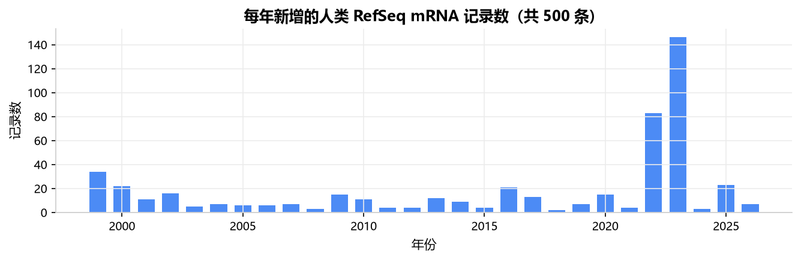
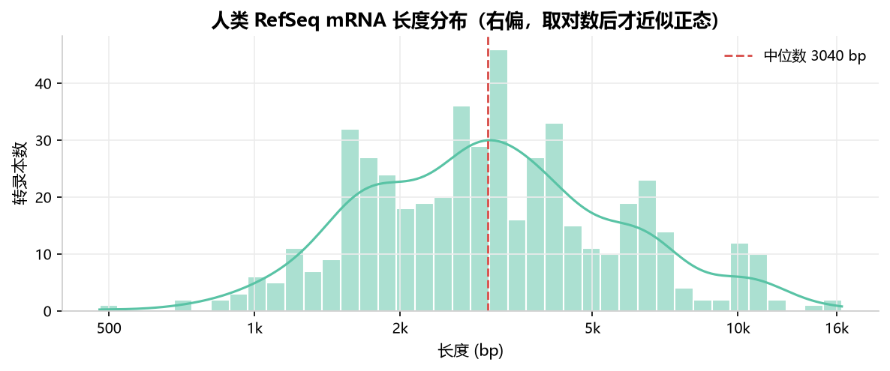
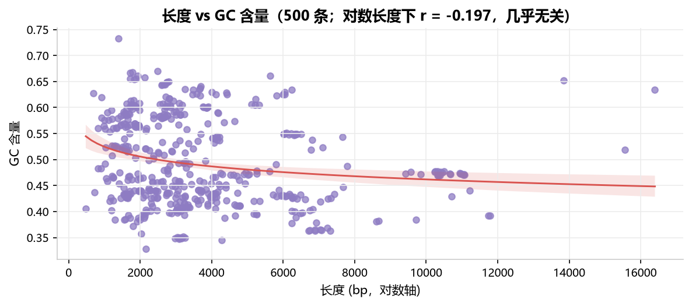

# 生物医药文献问答助手 · bio-ai-prep

一个面向生物医药场景的检索增强问答系统，外加配套的数据处理工具链。
**输入一个问题 → 检索真实文献 → 给出带 PMID 引用的中文回答**；资料里没有的内容它会直说不确定，不编。

[](https://github.com/LXM-66/bio-ai-prep/actions/workflows/tests.yml)
[](https://www.python.org/)
[](LICENSE)

```
问题：单细胞测序怎么用来研究肿瘤内部的细胞异质性？
检索式（自动改写）：single-cell sequencing tumor intratumoral heterogeneity cancer scRNA-seq
回答：单细胞测序可用 scRNA-seq 获取肿瘤样本数据，并结合 marker genes 鉴定细胞类型…[1]
      它能在 pan-cancer 层面构建肿瘤浸润 B/plasma cells 的 atlas…[2]
      在甲状腺癌原发灶与转移灶中，可刻画 intratumoral heterogeneity 与免疫抑制微环境…[3]

引用来源：[1] PMID 41635010  [2] PMID 39406187  [3] PMID 42430190 …
消耗 673 + 1115 tokens｜5.55 s｜0.005133 元
```

## 跑起来

```bash
uv venv && uv pip install --python .venv/Scripts/python.exe \
    --index-url https://pypi.tuna.tsinghua.edu.cn/simple -r requirements.txt

# 问答助手的三个用法
python rag/fetch_pubmed.py 100 "single-cell RNA sequencing AND cancer"   # ① 建语料（100 篇 PubMed 摘要）
python rag/build_index.py                                               # ② 切分 + 建索引
python rag/ask.py "单细胞测序怎么用来研究肿瘤内部的细胞异质性？"           # ③ 提问
python rag/report.py "单细胞测序在肿瘤免疫治疗中的应用" --limit 5          # ④ 生成中文速读报告

# 对话与成本
cp .env.example .env && 填入 DEEPSEEK_API_KEY
python llm_client/chat.py

# 数据与序列工具
python seq_tools/gc_content.py seq_tools/sample.fasta
python data_analysis/fetch_dataset.py 500 && python data_analysis/add_gc.py
# 清洗 + 出图：在 VS Code 里打开 data_analysis/分析.ipynb 逐格跑

# 测试
.venv/Scripts/python.exe -m pytest tests -q        # 17 passed
```

## 实测结果

**检索与生成**（语料 = 100 篇 PubMed 摘要 → 442 块 / 4,670 个词）

| 环节 | 结果 |
|---|---|
| 英文检索 | top1 = PMID 40804688（BM25 10.94），top5 全部相关 |
| 中文提问 | 自动改写为英文关键词后检索（跨语言必需，见下） |
| 生成回答 | 逐句带 [1]–[5] 引用｜673 + 1115 tokens｜5.55 s｜0.005133 元 |
| 边界测试 | 问语料里没有的（CRISPR 玉米育种）→ 回答「资料里没有提到」，不编 |
| 速读报告 | 5 篇文献 + 一篇主题综述，**0.034 元**，产物见 `rag/reports/` |

**成本工程**（`llm_client/logs/usage.csv` 累计实测）

| 指标 | 数值 |
|---|---|
| 同一段 1728 tokens 前缀第二次调用 | 缓存命中 1536，花费 **↓69%**（0.001968 → 0.000611 元） |
| 单次调用中位耗时 | 1.87 s |
| 网络抖动 | 自动重试 3 次（1s → 2s → 4s 退避），不把失败丢给用户 |

**数据分析**（500 条人类 RefSeq mRNA 记录）

| 指标 | 数值 |
|---|---|
| 记录 / 覆盖基因 | 500 条 / 142 个基因 |
| 序列长度 | 中位 3040 bp（478–16398 bp），强右偏 |
| GC 含量 | 中位 47.2%（32.8%–73.3%） |
| 对数长度 vs GC | r = **−0.197**（弱负相关：转录本越长，GC 略低） |






## 模块

```
bio-ai-prep/
├── rag/                    检索问答（系统主体）
│   ├── fetch_pubmed.py         esearch + efetch 拉摘要，构成语料
│   ├── text.py                 切分（句子边界 + 重叠）与中英混合分词
│   ├── store.py                BM25 索引：建索引 / 检索 / 存取
│   ├── query.py                中文问句 → 英文检索关键词
│   ├── ask.py                  提问 → 检索 → 带引用回答
│   ├── report.py               按主题生成中文速读报告
│   ├── build_index.py          切块建索引 → rag/index/bm25.json
│   ├── reports/                生成过的报告样例
│   └── data/pubmed.jsonl       语料（100 篇摘要，已入库）
├── llm_client/            大模型调用层（可复用于任何下游）
│   ├── llm.py                  流式 SSE / 超时 / 指数退避重试 / 按官方价目表计价
│   ├── chat.py                 命令行多轮对话（/cost /reset /exit）
│   └── logs/usage.csv          每次调用的 token 与花费流水
├── data_analysis/         真实数据清洗与可视化
│   ├── fetch_dataset.py        500 条 RefSeq mRNA 记录
│   ├── add_gc.py               复用 seq_tools 计算真实 GC（分批 + 重试）
│   └── 分析.ipynb              清洗 + 4 张图 + 结论（含真实输出）
├── seq_tools/             序列处理基础工具（纯标准库）
├── common/viz.py          统一出图规范：字体/配色/边框/dpi
├── tests/                 17 项单元测试（切分、分词、检索、序列算法）
└── requirements.txt · .env.example · LICENSE
```

## 设计取舍（都是被实际问题逼出来的）

| 决定 | 为什么 |
|---|---|
| **检索先用 BM25，不硬上向量** | DeepSeek 没有 embedding 接口，本地向量模型要下几百 MB；BM25 零依赖、可解释。检索层是独立一层，换语义检索只需重写 `store.py` 的 `search()`，上层不动 |
| **中文问题必须先改写成英文关键词** | 词面检索下中文词在英文索引里不存在 —— 直接检索中文主题的实测结果是「命中 96 万篇 + 一堆不相关文献」。改写一次约 0.0002 元，直接决定系统可用性 |
| **中文分词用 bigram 而非单字** | 单字会让「碱基编辑」和「基因」共享一个「基」字，毫不相关的问题也能召回；改成相邻两字成词后噪声消失（`tests/test_text.py` 覆盖了这个回归） |
| **切分按句子边界 + 重叠 100 字符** | 避免答案正好落在切口上；块长实测拿 600 与 400 对比过，小块分数更高但同一篇论文会重复占位，多样性变差 |
| **缺失值不填 0** | 0% GC 在生物学上不存在；填了会造出假数据点。分析时取子集，而不是伪造全量 |
| **指数退避重试 + 超时** | NCBI 与 API 都会间歇性超时（实测出现过多次 `WinError 10060`），不带重试会整批白跑 |
| **出图规范集中在一个文件** | 字体、配色、边框、dpi 一处控制，改一处所有图一起变；顺带解决了中文字体缺粗体字重的报警 |
| **成本按官方价目表实时计价** | 自动区分高峰/空闲（空闲半价）与缓存命中/未命中，每次调用落一行流水，随时能答"这个月花了多少" |

## 测试

```bash
.venv/Scripts/python.exe -m pytest tests -q     # 17 passed
```

- `test_text.py`：切分预算、句子边界、中英混合分词、bigram 不跨标点
- `test_store.py`：相关性排序、空查询、未知词不误召回、存取一致性
- `test_seq_tools.py`：GC 边界值、反向互补、终止密码子、FASTA 解析

## 局限与下一步

- **样本是切片**：语料是 PubMed 按主题检索的前 100 篇，不能外推到整个文献库；报告里也据此措辞。
- **词面检索的天花板**：同义改写（如 "tumor" vs "neoplasm"）目前召不回来，需要语义向量或查询扩展。
- **下一步**：多源语料（序列 / 蛋白结构 / 表达谱）→ 手写评测集与 hit@k 指标 → 简单 Web 界面 → 私有化部署选项（内部文档场景要求数据不外发）。

## 作者

李林峻 · GitHub [@LXM-66](https://github.com/LXM-66) · MIT License
